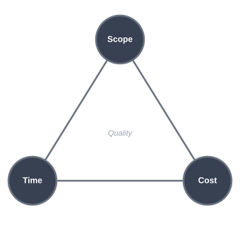
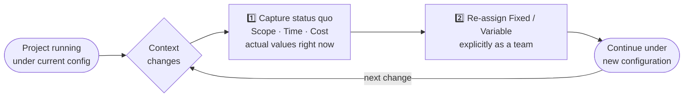
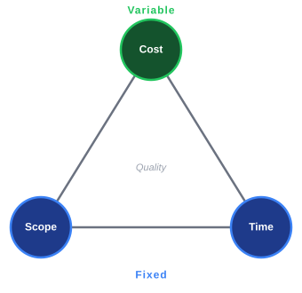
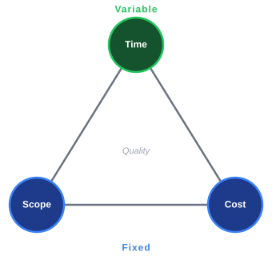
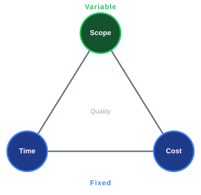
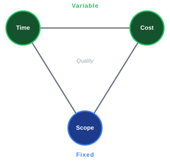
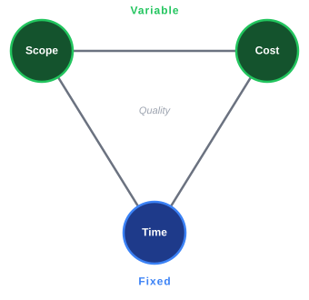
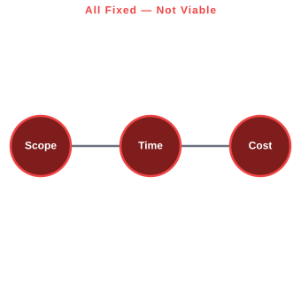
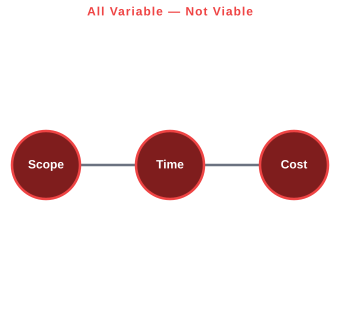

# A Manager's Guide to the Project Management Triangle

   
  <i>"Don't Panic" — a phrase from Douglas Adams' <a href="https://en.wikipedia.org/wiki/The_Hitchhiker%27s_Guide_to_the_Galaxy">The Hitchhiker's Guide to the Galaxy</a> (Adams, 1979).</i>

**Author:** Norbert Nopper — *created with the assistance of AI*

---

## Abstract

The **Project Management Triangle** — relating scope, time, and cost as interdependent constraints — is a well-established model in the project management literature (Barnes, 1969; Kerzner, 2017; Project Management Institute, 2017). Several extensions and adjacent contributions exist: quality as the implicit outcome of constraint balance (Atkinson, 1999), time-boxed iteration fixing time and cost while varying scope (Beck, 1999; Sutherland & Schwaber, 2020), deferred commitment in Lean development (Poppendieck & Poppendieck, 2003), buffer management in the Theory of Constraints (Goldratt, 1997), and strategic pivoting in Lean Startup methodology (Ries, 2011).

The individual ingredients of this document are therefore not new. What this document offers is a **novel synthesis**: a single, explicit framework that unifies these scattered ideas into a small, named set of configurations and a structured rule for moving between them. Concretely:

1. **A unified Fixed/Variable configuration map.** Each of the three constraints is classified as either *Fixed* (F) or *Variable* (V) at any point in time. All 2³ = 8 binary assignments are enumerated, the two degenerate cases (all-fixed, all-variable) are identified as non-viable, and the six valid configurations are aligned with established delivery patterns (Fixed-Price, Scrum, Cost-Plus, and so on). The enumeration is trivial in itself; the contribution is the *shared vocabulary* — the existing literature describes these configurations only in isolation, under method-specific names.

2. **Status-quo-anchored configuration pivoting (the principal novel element).** Building on Ries' (2011) notion of the pivot as a strategic course correction, this document defines *configuration pivoting*: the deliberate re-assignment of the F/V status of the triangle's constraints. The procedural claim is that the pivot is anchored to the **current actual values** of scope, time, and cost at the moment of re-configuration — not to the original plan — preserving continuity while changing the governing constraint model. Existing literature discusses *project* or *strategic* pivots; the explicit pivot of the *constraint configuration itself*, anchored to the present rather than the baseline, is the contribution made here.

3. **Intentionality as an explicit management decision.** The F/V assignment is treated as a first-class, openly negotiated decision rather than an emergent property of execution. This is more a framing argument than an empirical result, but framing matters: leaving the assignment implicit — as conventional triangle usage does — is a recurring source of unacknowledged trade-offs and stakeholder misalignment.

**Scope and limitations.** This is a practitioner-oriented synthesis, not a peer-reviewed empirical study. No quantitative validation is offered. The document is intended as a manager's reference: a vocabulary and a procedure, not a proof.

---

## The Classic Project Management Triangle

The **Project Management Triangle** (also called the *Iron Triangle* or *Triple Constraint*) is a foundational model in project management. It states that every project is constrained by three interdependent elements:

- **Scope** — what the project delivers (features, quality, requirements)
- **Time** — how long the project takes (schedule, deadline)
- **Cost** — how much the project spends (budget, resources)

The core insight is that these three constraints are coupled: changing one forces a change in at least one of the others. This is often summarized as:

> *"Good, fast, cheap — pick two."*

A widely accepted extension places **Quality** at the interior of the triangle, representing the implicit outcome that results from how the three constraints are balanced (Atkinson, 1999; Project Management Institute, 2017). Quality is not a fourth independent constraint — it is the emergent product of the trade-offs made among scope, time, and cost. All diagrams in this document label the interior accordingly.

---

## The Dynamic Project Management Triangle

The **Dynamic Project Management Triangle** extends the classic model by making the fixed/variable status of each constraint an explicit, first-class decision. At any point in a project, each of the three elements is either:

- **Fixed (F)** — this constraint is locked and must be respected.
- **Variable (V)** — this constraint is the absorber; it flexes to accommodate changes in the other two.

The key shift is *intentionality*: instead of discovering which constraint was implicitly sacrificed after the fact, teams agree upfront which element will absorb pressure.

---

## Pivoting in Project Management

In traditional project management the triangle is treated as static: constraints are agreed upon at the start and held firm. In practice, however, projects face changing requirements, shifting priorities, and unexpected events. **Pivoting** is the deliberate, structured act of re-negotiating the F/V assignment in response to new information.

The concept of pivoting originates in **Lean Startup methodology** (Ries, 2011), where a pivot means changing strategy while staying true to the underlying mission. Applied to the Dynamic Triangle, a configuration pivot proceeds in three steps:

1. **Take the status quo.** At the moment of the pivot, the current actual values of scope, time, and cost are captured as they stand — not the original plan, but the real state of the project right now.
2. **Re-assign fixed and variable.** From that baseline, the team explicitly decides which elements become fixed and which become variable going forward.
3. **Continue from there.** The new configuration governs the project until the next deliberate pivot.

A pivot is therefore not a reset and not an admission of failure — it is a structured handoff from one constraint configuration to another, anchored to reality.

---

## All Configurations of Fixed and Variable Constraints

With three binary constraints there are 2³ = **8 configurations**. Two of these (all-fixed and all-variable) are degenerate cases covered in the next section. The six meaningful configurations are:

---

### 1 — Scope Fixed · Time Fixed · Cost Variable *(Fixed-Price Contract)*

| Scope | Time | Cost |
|-------|------|------|
| F     | F    | **V**|

**What it means:** The deliverable and the deadline are locked. Budget expands or contracts as needed.

**When to use it:** Regulatory or contractual deliverables with hard deadlines (e.g., a compliance release that must ship before a legal effective date). Cost overruns are acceptable; missing scope or the deadline is not.

**Pivot signal:** Budget burn rate exceeds projections → re-examine whether scope or time can move before escalating cost further.

---

### 2 — Scope Fixed · Time Variable · Cost Fixed *(Internal Migration / Capped-Budget Delivery)*

| Scope | Time | Cost |
|-------|------|------|
| F     | **V**| F    |

**What it means:** The deliverable and the budget are locked. The schedule slips as required.

**When to use it:** Internal migrations, infrastructure replacements, or one-shot deliverables where the output specification is non-negotiable, the funding envelope is capped, but the launch date is flexible (e.g., a database migration that must complete correctly within budget but can take as long as needed). Note: this configuration is *not* a good fit for exploratory R&D — true R&D usually has variable scope (see Configuration 6).

**Pivot signal:** Repeated schedule slippage → consider whether some scope items can be deferred to bring the timeline back under control.

---

### 3 — Scope Variable · Time Fixed · Cost Fixed *(Scrum / Agile Sprint)*

| Scope | Time | Cost |
|-------|------|------|
| **V** | F    | F    |

**What it means:** The deadline and the budget are locked. Scope is cut or grown to fit.

**When to use it:** Time-boxed releases (e.g., a product launch tied to a trade show) where the date and team capacity are non-negotiable but the feature set can flex. This is the default mode of **Scrum** — the sprint is the fixed time-box; what ships in that sprint is variable.

**Pivot signal:** Scope keeps growing (scope creep) → prioritize ruthlessly or reset the scope baseline before cost or time are affected.

---

### 4 — Scope Fixed · Time Variable · Cost Variable *(Cost-Plus Contract)*

| Scope | Time | Cost |
|-------|------|------|
| F     | **V**| **V**|

**What it means:** The deliverable specification is the only non-negotiable. Both schedule and budget flex.

**When to use it:** Safety-critical or mission-critical systems (aerospace, medical devices) where correctness and completeness of scope cannot be compromised under any circumstance. Common in cost-plus government contracts.

**Pivot signal:** Both time and cost grow without bound → the scope definition itself may be ambiguous or gold-plating is occurring; return to scope baseline.

---

### 5 — Scope Variable · Time Fixed · Cost Variable *(Ship-to-Date / Market Launch)*

| Scope | Time | Cost |
|-------|------|------|
| **V** | F    | **V**|

**What it means:** The deadline is the only non-negotiable. Scope is pruned and budget adjusted to meet it.

**When to use it:** Market-window products where shipping late means shipping never (e.g., seasonal campaigns, competitive launches). Teams cut features and add resources simultaneously to hit the date.

**Pivot signal:** The deadline itself becomes commercially irrelevant (market window closed) → pivot to a Scope Fixed configuration and deliver correctly rather than quickly.

---

### 6 — Scope Variable · Time Variable · Cost Fixed *(Lean Startup / Fixed Runway / Exploratory R&D)*

| Scope | Time | Cost |
|-------|------|------|
| **V** | **V**| F    |

**What it means:** The budget is the only non-negotiable. Scope and schedule are negotiated continuously within that envelope.

**When to use it:** Startups with a fixed runway, exploratory research and development where the deliverable is unknown a priori, charitable projects with a fixed grant, or any situation where the funding envelope is the hard constraint and the team continuously re-prioritizes what to build and when.

**Pivot signal:** The budget ceiling is being approached without a shippable product → scope must be cut dramatically or a new funding round (pivot of the cost constraint itself) must be pursued.

---

## Why All-Fixed or All-Variable Does Not Work

### All Fixed (F · F · F)

| Scope | Time | Cost |
|-------|------|------|
| F     | F    | F    |

Fixing all three constraints simultaneously assumes the project can be planned with perfect precision and that no change will ever occur. In practice this is impossible because:

- **Reality changes.** Requirements evolve, dependencies shift, risks materialize.
- **Estimation is imprecise.** All three estimates carry uncertainty; fixing all three means there is no slack to absorb any of that uncertainty.
- **The system becomes brittle.** When the first deviation occurs (and it always does), there is no sanctioned variable to absorb it. The team is forced into covert trade-offs — hidden overtime, silent quality reduction, undisclosed scope cuts — none of which are visible to stakeholders.
- **It creates a culture of false reporting.** Because no legitimate flex exists, teams learn to report green status until the project collapses.

> All-fixed is not a plan; it is a wish with no contingency.

---

### All Variable (V · V · V)

| Scope | Time | Cost |
|-------|------|------|
| **V** | **V**| **V**|

Making all three constraints variable simultaneously removes all meaningful accountability and direction:

- **There is no target to optimize toward.** Without at least one fixed point, there is no way to define success or failure.
- **Scope, schedule, and budget all drift indefinitely.** Each individual change feels justified, but the cumulative effect is a project that never ends and never delivers.
- **Stakeholder alignment collapses.** Different stakeholders implicitly assume different constraints are fixed; with none formally anchored, every review meeting reopens every decision.
- **It is not agility — it is chaos.** Agile methods work precisely because they *do* fix at least one dimension (the time-box or the team size/cost), making the model a 6-configuration problem, not an unconstrained one.

> All-variable is not flexibility; it is the absence of a project.

---

## Summary Table

| # | Scope | Time | Cost | Methodology / Pattern |
|---|-------|------|------|-----------------------|
| 1 | F | F | V | Fixed-Price Contract |
| 2 | F | V | F | Internal Migration / Capped-Budget Delivery |
| 3 | V | F | F | Scrum / Agile Sprint |
| 4 | F | V | V | Cost-Plus Contract |
| 5 | V | F | V | Ship-to-Date / Market Launch |
| 6 | V | V | F | Lean Startup / Fixed Runway / Exploratory R&D |
| — | F | F | F | ❌ All fixed — not viable |
| — | V | V | V | ❌ All variable — not viable |

**F** = Fixed (blue in diagrams) · **V** = Variable (green in diagrams) · Interior label *Quality* = the outcome dimension implicitly governed by the chosen configuration

---

## References

Adams, D. (1979). *The Hitchhiker's Guide to the Galaxy*. Pan Books. — "Don't Panic."

Atkinson, R. (1999). Cost, time and quality, two best guesses and a phenomenon, its time to accept other success criteria. *Information Systems Journal*, 9(3), 337–342.

Barnes, M. (1969). *Time, cost and quality — the three constraints of project management*. Proceedings of the Symposium on the Control of Engineering Design. Institution of Mechanical Engineers.

Beck, K. (1999). *Extreme Programming Explained: Embrace Change*. Addison-Wesley. — Time-boxed iteration as a mechanism for fixing time and cost while varying scope.

Goldratt, E. M. (1997). *Critical Chain*. North River Press.

Kerzner, H. (2017). *Project Management: A Systems Approach to Planning, Scheduling, and Controlling* (12th ed.). Wiley.

Poppendieck, M., & Poppendieck, T. (2003). *Lean Software Development: An Agile Toolkit*. Addison-Wesley.

Project Management Institute. (2017). *A Guide to the Project Management Body of Knowledge (PMBOK® Guide)* (6th ed.). PMI.

Ries, E. (2011).*The Lean Startup: How Today's Entrepreneurs Use Continuous Innovation to Create Radically Successful Businesses*. Crown Business.

Sutherland, J., & Schwaber, K. (2020). *The Scrum Guide*. Scrum.org. https://scrumguides.org

Wysocki, R. K. (2014). *Effective Project Management: Traditional, Agile, Extreme* (7th ed.). Wiley.
